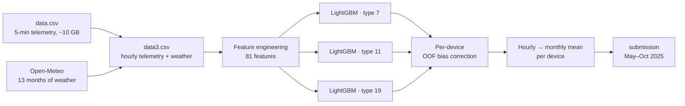
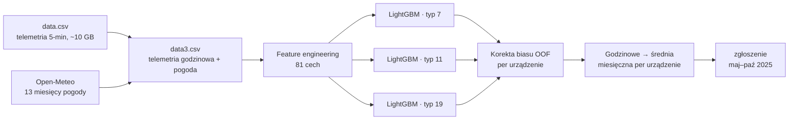

# ⚡ Heat Pump Grid Load Forecasting — EnsembleAI Hackathon 2026


**🇬🇧 English** · [🇵🇱 Polski](#polski)

<a id="english"></a>

**Time-series forecasting of electrical grid load for a fleet of heat pumps across Poland.** This is our solution to
**Task 3 (set by Euros Energy) at the EnsembleAI Hackathon 2026**, where our team **Random Overfitters** finished
**🥈 2nd overall and won 6,000 PLN**.

Using IoT telemetry from a single heating season (Oct 2024 – Apr 2025), the model forecasts the **average monthly grid load
of every device for May – Oct 2025**. That is a 6-month-ahead, per-device forecast into a season the training data doesn't cover.

---

## 🏆 Result

**Team Random Overfitters: 🥈 2nd place overall (6,000 PLN prize)** across four very different challenges:

- 🥇 1st place in Task 2
- 🎖️ 4th place in Task 4
- solid results in the remaining tasks, including this one (Task 3)

---

## ✨ Highlights

- **Seasonal extrapolation under distribution shift**: trained on winter behaviour, evaluated on summer and autumn
- **13 months of external weather data from Open-Meteo**, pulled during the hackathon; this was our edge (see [below](#weather))
- **~10 GB of 5-minute sensor telemetry**, handled with chunked loading, subsampling and hourly resampling
- **Final model**: a separate **LightGBM** model for each of the 3 device types, with **81 engineered features**: cyclical calendar encodings, heat-exchanger thermodynamics, non-linear temperature regimes, rolling windows, exogenous weather, per-device load profiles and temperature-response slopes
- **Out-of-fold (OOF) residual bias correction** per device
- **Recency-weighted training**: the months closest to the forecast window count the most
- Explored along the way: monthly GBM baselines, an **LSTM + XGBoost + LightGBM** ensemble with **spatial nearest-neighbour features**, **per-device Prophet** models and a heavier LightGBM variant

---

## 🧩 The challenge

> *"The goal of this challenge is to develop a high-precision predictive system that utilizes historical data from 2024
> to forecast the total electrical load for the summer-autumn of 2025. This is an extrapolation task…"* (task statement, Euros Energy)

Poland is rapidly electrifying home heating, and Distribution System Operators need to know how much load heat pumps will put
on the grid in the coming months. The task: for every device **d** and month **m**, predict the mean of the grid load
indicator `x2` over all 5-minute readings in that month:

$$\text{target}_{d,m} = \frac{1}{N_{d,m}} \sum_{i=1}^{N_{d,m}} x_2^{(d,m,i)}$$

| Split | Period | `x2` available | Weight in final score |
|---|---|---|---|
| Train | Oct 2024 – Apr 2025 (7 months) | ✅ | — |
| Validation (public leaderboard) | May – Jun 2025 | ❌ | 2/6 |
| Test (hidden) | Jul – Oct 2025 | ❌ | 4/6 |

**Metric:** MAE over all device-month predictions.

**Why it's hard**

- **Out-of-distribution forecasting.** The training window is almost entirely heating season. From May to September, heat pumps work in a different regime (hot water, little or no space heating), so the model must extrapolate to conditions it barely saw.
- **Hidden-test-heavy scoring.** The public leaderboard showed only May–Jun, while 2/3 of the final score came from the hidden Jul–Oct months. Overfitting the leaderboard would have been punished.
- **Heterogeneous fleet.** Three device types with very different load profiles, and anonymised telemetry: 13 min–max-normalised temperature sensors, compressor frequency and heating-curve type.
- **Data volume.** 5-minute readings for every device: around 10 GB of raw CSV.

---

<a id="weather"></a>

## 🌦️ Our edge: 13 months of extra weather data

The organisers provided only device telemetry. We added **external weather data from the [Open-Meteo](https://open-meteo.com/)
API** for the devices' locations across Poland, covering the **whole period from October 2024 to October 2025**:
14 hourly and daily variables, including air and apparent temperature, humidity, dew point, cloud cover, wind, pressure, sunshine duration,
rain, showers, weather code, UV index and precipitation probability.

**Why it mattered.** For May–Oct, `x2` is withheld and the telemetry is only partial, so the model has little direct
evidence about summer. Weather is the main external driver of heat-pump load, and it is fully available for the forecast months.
With it, the model knew how warm, sunny or rainy each month actually was instead of guessing from winter data alone.
Weather-derived features, such as air temperature and the apparent-vs-air temperature gap, were among the model's most important features.

**How it happened.** Getting the data became a side quest of its own. Open-Meteo's free tier limits how much you can
download at once, so two of us spent **about 4 hours** pulling 13 months of weather in small slices. Every time we hit the
limit, another teammate's phone became the next mobile hotspot. For a while we were switching networks more often than
hyperparameters 📱. The rest of the team, busy with the other three challenges, lent their phones to the cause.

> The one-off download and preprocessing scripts (API pulls, resampling the 5-minute telemetry to hourly, joining weather
> to each device, which produces `data3.csv`) were run during the hackathon and are not part of this repository. The model scripts
> start from the prepared `data3.csv`.

---

## 🛠️ Solution

### Pipeline



### Feature engineering

Rolling features are computed **per device** and look **backward only** (`.rolling()`, no look-ahead).

| Group | Features | Why |
|---|---|---|
| Calendar (cyclical) | sin/cos of hour, day-of-week and month; `is_night` (22:00–06:59), `is_weekend` | 23:00 is next to 00:00 and December is next to January |
| Heat-pump thermodynamics | outdoor−indoor delta, source/load heat-exchanger deltas, `hex_cross = (t3−t5)·(t4−t6)`, heating / cooling demand relative to a comfort threshold (0.7 on normalised indoor temperature) | encodes what actually drives compressor work |
| Non-linear temperature | `temp²`, warm/cold hinge features around 10 °C, temperature × night | heat-pump load is piecewise in outdoor temperature |
| Exogenous weather | the 14 Open-Meteo variables, plus apparent-vs-air and weather-vs-indoor temperature deltas | drivers that are also known for the forecast months |
| Rolling windows | 6 h and 24 h rolling means of air temperature, outdoor and indoor sensors, source-air temperature and compressor frequency; 24 h rolling std of temperature | short-term dynamics, thermal inertia and weather trends |
| Device type | one-hot device type (7, 11, 19) and temperature × type interactions | the three types respond to temperature differently |
| Device profiles (target encoding) | per-device mean / std / median / min / max of `x2`, per-device hourly profile, device-type statistics | captures each unit's baseline and daily rhythm |
| Temperature response | per-device regression slope of `x2` vs temperature, overall and in the warm (> 10 °C) regime | shows how strongly each unit reacts to warmer weather, which is the key signal for summer extrapolation |

### Training

- **Segmented modelling**: a separate LightGBM model for each device type (7, 11, 19), because their load curves differ too much for one model.
- **Settings**: 2,000 trees, learning rate 0.02, 127 leaves, depth 10, 70 % column subsampling, L1/L2 regularisation.
- **Recency weighting**: April and October ×2.0, because these transition months are closest to the forecast window. Deep winter (Dec–Feb) gets ×0.7.
- **5-fold out-of-fold predictions** on the training set feed the bias correction, and the final model is then refit on 100 % of each type's data.

### Bias correction

```text
residual    = x2 − oof_prediction
bias[dev]   = mean(residual)  per device
prediction += bias[dev]
```

If the model systematically under-predicts a device by 0.02, it adds 0.02 back to all of that device's predictions. This works well for units with unusual consumption profiles.

### Aggregation and validation

- Hourly predictions are averaged to **monthly means per device**, the same way the target is defined, and clipped to ≥ 0.
- Missing device-month combinations are filled with the device's historical mean.
- Sanity check: OOF monthly MAE on the training months, with April reported separately because it is the closest month to the forecast window.

---

## 🔬 How the approach evolved

| Stage | Where | Idea |
|---|---|---|
| 0 | `example_submission.py` | Baseline adapted from the organisers' starter kit: monthly aggregates → LightGBM, plus the submission API client |
| 1 | notebooks (in git history) | Colab pipeline with chunked loading and 20 % subsampling of the 10 GB CSV; LightGBM on monthly aggregates with lag features; **LSTM + XGBoost + LightGBM** ensemble; **distance-weighted k-nearest-neighbour features** (haversine) from nearby devices |
| 2 | `prophet.py`, `prophet_new.py` | **Per-device Prophet** on daily aggregates: multiplicative weekly seasonality, exogenous regressors (outdoor temperature sensor, compressor frequency, Open-Meteo air temperature, 12 h temperature delta, device-type mean), parallelised across CPU cores |
| 3 ⭐ | `prev_optimized.py` | **Final model, our best score**: hourly per-device-type LightGBM, 81 features including weather, rolling windows, non-linear temperature, per-device OOF bias correction |
| 4 | `new_optimized.py` | Heavier variant: 118 features (lags, 48 h / 168 h windows, day-of-year, device × month profiles, geolocation), MAE objective, 3-seed ensemble, device × month bias correction. It **did not beat stage 3** on the final score |
| tool | `scale_submission.py` | Post-hoc seasonal scaling of a submission (May–Aug × A, Sep–Oct × B) for quick what-if tests |

**Lesson learned: more wasn't better.** Our read is that much of the extra signal in stage 4 (device × month profiles,
seasonal bias) only exists for months seen in training, so it didn't transfer to the unseen summer. Under distribution
shift, the simpler model generalised better.

---

## 🗂️ Repository structure

```text
.
├── README.md
├── TASK.md                    # task statement as text
├── task3*.jpg                 # original task statement (Euros Energy)
└── solution_task3/
    ├── prev_optimized.py      # ⭐ final model: per-type LightGBM + per-device bias correction
    ├── new_optimized.py       # heavier variant (118 features, seed ensemble)
    ├── prophet_new.py         # per-device Prophet with extra regressors, multiprocessing
    ├── prophet.py             # first Prophet baseline
    ├── example_submission.py  # starter-kit baseline + submission API client
    └── scale_submission.py    # post-hoc seasonal scaling of a submission
```

**Input:** `data3.csv`, hourly per-device telemetry joined with Open-Meteo weather and a `period` column (train / valid / test).
**Output:** `submission_optimized.csv`, one row per device and month for May–Oct 2025 (`deviceId, year, month, prediction`).

---

## 👥 Team: Random Overfitters

- **Igor Stec**: [GitHub](https://github.com/igorstec)
- **Filip Manijak**: [LinkedIn](https://www.linkedin.com/in/filip-manijak-7a8051277/)
- **Michał Pitera**: [LinkedIn](https://www.linkedin.com/in/micha%C5%82-pitera-13b94b298/)
- **Michał Szymocha**: [LinkedIn](https://www.linkedin.com/in/micha%C5%82-szymocha/)
- **Maciej Wiśniewski**: [LinkedIn](https://www.linkedin.com/in/maciej-wi%C5%9Bniewski-674414358/)

*Competing as Random Overfitters and still generalising well enough for a podium finish felt like a solid result 😄*

---
---

<a id="polski"></a>

# 🇵🇱 Polski

[🇬🇧 English](#english) · **🇵🇱 Polski**

**Prognozowanie szeregów czasowych obciążenia sieci elektroenergetycznej przez flotę pomp ciepła w Polsce.** To nasze
rozwiązanie **Task 3 (zadanie od Euros Energy) na EnsembleAI Hackathon 2026**, na którym nasz zespół **Random Overfitters**
zajął **🥈 2. miejsce w klasyfikacji ogólnej i wygrał 6 000 zł**.

Na podstawie telemetrii IoT z jednego sezonu grzewczego (paź 2024 – kwi 2025) model prognozuje **średnie miesięczne
obciążenie sieci dla każdego urządzenia na maj – październik 2025**. To prognoza na 6 miesięcy do przodu, per urządzenie,
w sezon, którego nie obejmują dane treningowe.

## 🏆 Wynik

**Zespół Random Overfitters: 🥈 2. miejsce w klasyfikacji ogólnej (nagroda 6 000 zł)** w czterech bardzo różnych zadaniach:

- 🥇 1. miejsce w Task 2
- 🎖️ 4. miejsce w Task 4
- solidne wyniki w pozostałych zadaniach, również w tym (Task 3)

## ✨ Najważniejsze

- **Ekstrapolacja sezonowa przy przesunięciu rozkładu (distribution shift)**: trening na zachowaniu zimowym, ocena na lecie i jesieni
- **13 miesięcy zewnętrznych danych pogodowych z Open-Meteo**, pobranych w trakcie hackathonu; to była nasza przewaga (zob. [niżej](#pogoda))
- **~10 GB 5-minutowej telemetrii z czujników**: wczytywanie porcjami (chunking), subsampling i resampling do danych godzinowych
- **Model finalny**: osobny model **LightGBM** dla każdego z 3 typów urządzeń, z **81 cechami**: cykliczne kodowanie kalendarza, termodynamika wymienników ciepła, nieliniowe reżimy temperatury, okna kroczące, pogoda jako zmienne egzogeniczne, profile obciążenia per urządzenie i wrażliwość na temperaturę
- **Korekta biasu na podstawie reszt out-of-fold (OOF)** per urządzenie
- **Ważenie próbek według świeżości**: miesiące najbliższe okresowi prognozy ważą najwięcej
- Po drodze przetestowane: bazowe GBM na agregatach miesięcznych, ensemble **LSTM + XGBoost + LightGBM** z **przestrzennymi cechami najbliższych sąsiadów**, **Prophet per urządzenie** oraz cięższy wariant LightGBM

## 🧩 Wyzwanie

Polska szybko elektryfikuje ogrzewanie domów, a operatorzy systemów dystrybucyjnych (OSD) muszą wiedzieć, jakie obciążenie
sieci wygenerują pompy ciepła w kolejnych miesiącach. Zadanie: dla każdego urządzenia **d** i miesiąca **m** przewidzieć średnią
wskaźnika obciążenia sieci `x2` ze wszystkich 5-minutowych odczytów w tym miesiącu:

$$\text{target}_{d,m} = \frac{1}{N_{d,m}} \sum_{i=1}^{N_{d,m}} x_2^{(d,m,i)}$$

| Zbiór | Okres | `x2` dostępne | Waga w wyniku końcowym |
|---|---|---|---|
| Treningowy | paź 2024 – kwi 2025 (7 miesięcy) | ✅ | — |
| Walidacyjny (publiczny leaderboard) | maj – cze 2025 | ❌ | 2/6 |
| Testowy (ukryty) | lip – paź 2025 | ❌ | 4/6 |

**Metryka:** MAE po wszystkich predykcjach urządzenie-miesiąc.

**Dlaczego to trudne**

- **Prognoza poza rozkładem treningowym.** Dane treningowe to prawie wyłącznie sezon grzewczy. Od maja do września pompy ciepła pracują w innym trybie (ciepła woda użytkowa, brak lub mało grzania), więc model musi ekstrapolować na warunki, których prawie nie widział.
- **Wynik zależny głównie od ukrytego testu.** Publiczny leaderboard pokazywał tylko maj–czerwiec, a 2/3 wyniku końcowego pochodziło z ukrytych miesięcy lipiec–październik. Przeuczenie się pod leaderboard byłoby ukarane.
- **Niejednorodna flota.** Trzy typy urządzeń o bardzo różnych profilach obciążenia oraz zanonimizowana telemetria: 13 czujników temperatury znormalizowanych min–max, częstotliwość sprężarki i typ krzywej grzewczej.
- **Wolumen danych.** Odczyty co 5 minut dla każdego urządzenia: około 10 GB surowego CSV.

<a id="pogoda"></a>

## 🌦️ Nasza przewaga: 13 miesięcy dodatkowych danych pogodowych

Organizatorzy udostępnili wyłącznie telemetrię urządzeń. Dołożyliśmy **zewnętrzne dane pogodowe z API
[Open-Meteo](https://open-meteo.com/)** dla lokalizacji urządzeń w całej Polsce, obejmujące **cały okres od października 2024
do października 2025**: 14 zmiennych godzinowych i dziennych, w tym temperaturę powietrza i odczuwalną, wilgotność, punkt rosy,
zachmurzenie, wiatr, ciśnienie, nasłonecznienie, deszcz, przelotne opady, kod pogody, indeks UV i prawdopodobieństwo opadów.

**Dlaczego to było ważne.** Dla maja–października `x2` jest ukryte, a telemetria niepełna, więc model ma niewiele
bezpośrednich informacji o lecie. Pogoda to główny zewnętrzny czynnik wpływający na obciążenie pomp ciepła i jest w pełni
dostępna dla miesięcy prognozy. Dzięki niej model wiedział, jak ciepły, słoneczny czy deszczowy był każdy miesiąc, zamiast
zgadywać wyłącznie na podstawie danych zimowych. Cechy pogodowe, np. temperatura powietrza i różnica między temperaturą odczuwalną
a faktyczną, były jednymi z najważniejszych cech modelu.

**Jak to wyglądało.** Pobranie danych okazało się osobnym zadaniem pobocznym. Darmowa wersja Open-Meteo ogranicza,
ile można pobrać naraz, więc we dwóch spędziliśmy **około 4 godzin**, ściągając 13 miesięcy pogody w małych kawałkach.
Za każdym razem, gdy dobijaliśmy do limitu, telefon kolejnej osoby z zespołu zostawał nowym hotspotem. Przez chwilę
zmienialiśmy sieci częściej niż hiperparametry 📱. Reszta zespołu, zajęta pozostałymi trzema zadaniami, oddała swoje
telefony na potrzeby sprawy.

> Jednorazowe skrypty do pobierania i preprocessingu (zapytania do API, resampling 5-minutowej telemetrii do godzinowej,
> dołączenie pogody do każdego urządzenia, co daje `data3.csv`) były uruchamiane w trakcie hackathonu i nie są częścią tego
> repozytorium. Skrypty modeli startują od gotowego `data3.csv`.

## 🛠️ Rozwiązanie

### Pipeline



### Feature engineering

Cechy kroczące są liczone **osobno dla każdego urządzenia** i korzystają **wyłącznie z danych wstecz** (`.rolling()`, bez zaglądania w przyszłość).

| Grupa | Cechy | Po co |
|---|---|---|
| Kalendarz (cyklicznie) | sin/cos godziny, dnia tygodnia i miesiąca; `is_night` (22:00–06:59), `is_weekend` | 23:00 sąsiaduje z 00:00, a grudzień ze styczniem |
| Termodynamika pompy ciepła | różnica zewnętrzna−wewnętrzna, różnice na wymiennikach source/load, `hex_cross = (t3−t5)·(t4−t6)`, zapotrzebowanie na grzanie / chłodzenie względem progu komfortu (0.7 na znormalizowanej temperaturze wewnętrznej) | opisuje to, co faktycznie napędza pracę sprężarki |
| Nieliniowa temperatura | `temp²`, cechy „zawiasowe” ciepło/zimno wokół 10 °C, temperatura × noc | obciążenie pompy ciepła zależy od temperatury odcinkowo |
| Pogoda (zmienne egzogeniczne) | 14 zmiennych z Open-Meteo oraz różnice: odczuwalna vs faktyczna i pogodowa vs wewnętrzna | czynniki znane także dla miesięcy prognozy |
| Okna kroczące | średnie kroczące 6 h i 24 h temperatury powietrza, czujników zewnętrznego i wewnętrznego, temperatury powietrza na wymienniku i częstotliwości sprężarki; odchylenie std temperatury z 24 h | krótkoterminowa dynamika, bezwładność cieplna i trendy pogodowe |
| Typ urządzenia | one-hot typu urządzenia (7, 11, 19) i interakcje temperatura × typ | trzy typy inaczej reagują na temperaturę |
| Profile urządzeń (target encoding) | średnia / std / mediana / min / max `x2` per urządzenie, profil godzinowy per urządzenie, statystyki typu urządzenia | poziom bazowy i rytm dobowy każdej jednostki |
| Reakcja na temperaturę | nachylenie regresji `x2` względem temperatury per urządzenie, ogólne i w reżimie ciepłym (> 10 °C) | jak mocno dana jednostka reaguje na ocieplenie; kluczowy sygnał do ekstrapolacji na lato |

### Trening

- **Modelowanie segmentowe**: osobny model LightGBM dla każdego typu urządzenia (7, 11, 19), bo ich krzywe obciążenia za bardzo się różnią, żeby obsłużył je jeden model.
- **Ustawienia**: 2000 drzew, learning rate 0.02, 127 liści, głębokość 10, 70 % subsamplingu kolumn, regularyzacja L1/L2.
- **Ważenie według świeżości**: kwiecień i październik ×2.0, bo to miesiące przejściowe, najbliższe okresowi prognozy. Głęboka zima (gru–lut) dostaje ×0.7.
- **5-krotne predykcje out-of-fold** na zbiorze treningowym zasilają korektę biasu, a model finalny jest trenowany na 100 % danych danego typu.

### Korekta biasu

```text
reszta        = x2 − predykcja_oof
bias[urz]     = średnia(reszta)  per urządzenie
predykcja    += bias[urz]
```

Jeśli model systematycznie zaniża urządzenie o 0.02, dodaje 0.02 do wszystkich jego predykcji. Działa to dobrze dla urządzeń o nietypowym profilu zużycia.

### Agregacja i walidacja

- Predykcje godzinowe są uśredniane do **średnich miesięcznych per urządzenie**, dokładnie tak, jak zdefiniowany jest target, i przycinane do ≥ 0.
- Brakujące kombinacje urządzenie-miesiąc są uzupełniane historyczną średnią urządzenia.
- Kontrola: OOF monthly MAE na miesiącach treningowych, osobno dla kwietnia, bo to miesiąc najbliższy okresowi prognozy.

## 🔬 Jak ewoluowało podejście

| Etap | Gdzie | Pomysł |
|---|---|---|
| 0 | `example_submission.py` | Baseline na bazie starter kitu organizatorów: agregaty miesięczne → LightGBM oraz klient API do wysyłania zgłoszeń |
| 1 | notebooki (w historii gita) | Pipeline w Colabie z wczytywaniem porcjami i 20 % subsamplingiem 10 GB CSV; LightGBM na agregatach miesięcznych z lagami; ensemble **LSTM + XGBoost + LightGBM**; **ważone odległością cechy k najbliższych sąsiadów** (haversine) z pobliskich urządzeń |
| 2 | `prophet.py`, `prophet_new.py` | **Prophet per urządzenie** na agregatach dziennych: multiplikatywna sezonowość tygodniowa, regresory egzogeniczne (czujnik temperatury zewnętrznej, częstotliwość sprężarki, temperatura powietrza z Open-Meteo, delta temperatury 12 h, średnia typu urządzenia), zrównoleglone na rdzenie CPU |
| 3 ⭐ | `prev_optimized.py` | **Model finalny, nasz najlepszy wynik**: godzinowy LightGBM per typ urządzenia, 81 cech z pogodą, okna kroczące, nieliniowa temperatura, korekta biasu OOF per urządzenie |
| 4 | `new_optimized.py` | Cięższy wariant: 118 cech (lagi, okna 48 h / 168 h, dzień roku, profile urządzenie × miesiąc, geolokalizacja), funkcja celu MAE, ensemble 3 seedów, korekta biasu urządzenie × miesiąc. **Nie pobił etapu 3** w wyniku końcowym |
| narzędzie | `scale_submission.py` | Ręczne skalowanie sezonowe zgłoszenia (maj–sie × A, wrz–paź × B) do szybkich testów „co jeśli” |

**Wniosek: więcej nie znaczy lepiej.** Naszym zdaniem duża część dodatkowego sygnału w etapie 4 (profile urządzenie ×
miesiąc, sezonowy bias) istnieje tylko dla miesięcy widzianych w treningu, więc nie przeniosła się na nieznane lato.
Przy przesunięciu rozkładu prostszy model generalizował lepiej.

## 🗂️ Struktura repozytorium

```text
.
├── README.md
├── TASK.md                    # treść zadania w formie tekstowej
├── task3*.jpg                 # oryginalna treść zadania (Euros Energy)
└── solution_task3/
    ├── prev_optimized.py      # ⭐ model finalny: LightGBM per typ + korekta biasu per urządzenie
    ├── new_optimized.py       # cięższy wariant (118 cech, ensemble seedów)
    ├── prophet_new.py         # Prophet per urządzenie z dodatkowymi regresorami, multiprocessing
    ├── prophet.py             # pierwszy baseline Prophet
    ├── example_submission.py  # baseline ze starter kitu + klient API
    └── scale_submission.py    # ręczne skalowanie sezonowe zgłoszenia
```

**Wejście:** `data3.csv`, godzinowa telemetria per urządzenie połączona z pogodą z Open-Meteo i kolumną `period` (train / valid / test).
**Wyjście:** `submission_optimized.csv`, jeden wiersz na urządzenie i miesiąc dla maja–października 2025 (`deviceId, year, month, prediction`).

## 👥 Zespół: Random Overfitters

- **Igor Stec**: [GitHub](https://github.com/igorstec)
- **Filip Manijak**: [LinkedIn](https://www.linkedin.com/in/filip-manijak-7a8051277/)
- **Michał Pitera**: [LinkedIn](https://www.linkedin.com/in/micha%C5%82-pitera-13b94b298/)
- **Michał Szymocha**: [LinkedIn](https://www.linkedin.com/in/micha%C5%82-szymocha/)
- **Maciej Wiśniewski**: [LinkedIn](https://www.linkedin.com/in/maciej-wi%C5%9Bniewski-674414358/)

*Startując jako Random Overfitters i wciąż generalizując na tyle dobrze, żeby stanąć na podium, uznajemy to za solidny wynik 😄*

---
---

<a id="task"></a>

## 📄 Original task statement · Oryginalna treść zadania

Also available as text / Dostępne też jako tekst: [`TASK.md`](TASK.md)


